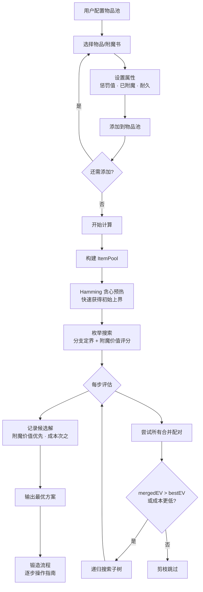

# ⚒️ BestEnchSeq — Minecraft 铁砧附魔最优顺序计算器

计算在铁砧上附魔的**最优合并顺序**，以最低经验消耗获得满附魔物品。

支持 **Java Edition** 和 **Bedrock Edition**，覆盖 1.21+ 版本全部 **42 种附魔**和 **23 种可附魔物品**（含矛 Spear）。

> 🌐 在线使用：[bes.ozo.ooo](https://bes.ozo.ooo)

## ✨ 功能

- 🎯 **枚举搜索最优解** — 分支定界全搜索，保证找到经验花费最低的合并方案
- 🔀 **多物品合并** — 支持多个同类预附魔物品 + 附魔书混合计算
- ⏱️ **可配置超时** — 搜索超时 1–120 秒可调
- 🔄 **惩罚值支持** — 可为已使用过铁砧的物品设置先验惩罚
- 📋 **逐步指南** — 清晰展示每一步的合并操作和经验消耗
- 🌏 **双语界面** — 中文界面，附魔名称中英文对照
- 🎮 **完整数据** — 覆盖包括矛 (Spear)、锤 (Mace)、刷子 (Brush) 在内的所有 1.21+ 物品和附魔

##  快速开始

### 前置要求

- [Node.js](https://nodejs.org/) >= 18
- npm 或 pnpm

### 安装与运行

```bash
# 克隆仓库
git clone https://github.com/mciart/best-ench-seq.git
cd best-ench-seq

# 安装依赖
cd web
npm install

# 启动开发服务器
npm run dev
```

打开浏览器访问 `http://localhost:5173`

### 构建生产版本

```bash
cd web
npm run build
```

构建输出位于 `web/dist/`，可直接部署到任何静态托管服务。

### 部署到 EdgeOne Pages / Cloudflare Pages

连接 GitHub 仓库后，填写以下构建配置即可自动部署：

| 配置项 | 值 |
|--------|------|
| 框架预设 | `Other` / `None` |
| 根目录 | `./` |
| 安装命令 | `cd web && npm install` |
| 构建命令 | `cd web && npm run build` |
| 输出目录 | `web/dist` |

每次 `git push` 会自动触发构建和部署。

## 📁 项目结构

```
BestEnchSeq/
├── core/                       # 核心计算逻辑（框架无关）
│   ├── algorithms/
│   │   ├── difficultyFirst.js  # 难度优先算法（内部使用）
│   │   ├── hamming.js          # 海明距离算法（枚举预热）
│   │   └── enumeration.js      # 枚举搜索（分支定界 + 贪心预热）
│   ├── data/
│   │   ├── weapons.json        # 可附魔物品数据
│   │   └── enchantments.json   # 附魔属性数据
│   ├── calculator.js           # 计算入口
│   ├── forge.js                # 铁砧合并机制实现
│   ├── itemPool.js             # 物品池管理
│   ├── types.js                # 类型定义
│   └── index.js                # 核心模块导出
├── web/                        # Vue 3 前端
│   ├── src/
│   │   ├── views/              # 页面组件（两步流程）
│   │   ├── stores/             # Pinia 状态管理
│   │   ├── components/         # 通用组件
│   │   └── assets/             # 样式资源
│   ├── public/
│   │   └── icons/              # Minecraft 物品图标
│   └── vite.config.js
├── .gitignore
└── README.md
```

## 🔄 计算流程



## 🎮 使用方法

### 第一步：配置物品池

1. 选择游戏版本（Java / 基岩）
2. 从物品网格中选择要附魔的物品或附魔书
3. 配置物品属性（惩罚值、是否受损、已有附魔）
4. 点击「添加到物品池」，重复添加所需的所有物品和附魔书
5. 点击「开始计算」

### 第二步：查看结果

查看最优合并顺序、总经验消耗、逐步操作指南。支持导出计算结果。

## 🔧 技术栈

| 层级 | 技术 |
|------|------|
| 前端框架 | Vue 3 (Composition API) |
| 构建工具 | Vite 7 |
| 状态管理 | Pinia 3 |
| 核心逻辑 | 原生 JavaScript (ES Modules) |
| 样式 | CSS (Minecraft 暗色主题) |

## 📊 算法说明

### 枚举搜索 (Enumeration)

使用分支定界 (Branch and Bound) 算法搜索所有可能的合并树，包括书与书之间的预合并和同类物品合并。

**优化策略：**

- **贪心预热** — 使用 Hamming 算法快速得到初始上界，大幅缩小搜索空间
- **下界剪枝** — 估算剩余合并的最低成本，提前剪掉不可能优于当前最优的分支
- **最优优先** — 每步优先探索代价最低的合并，加速收敛
- **类型约束** — 自动跳过不兼容的物品合并（剑+镐等）

## 📜 物品图标

物品图标来源于 [Mojang/bedrock-samples](https://github.com/Mojang/bedrock-samples)（Minecraft 官方基岩版资源包），版权归 Mojang Studios / Microsoft 所有。

## 📄 License

MIT
