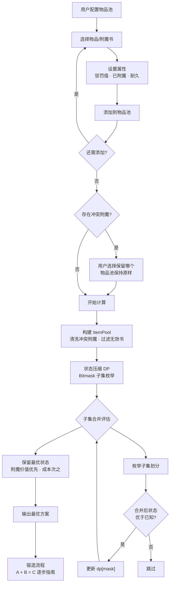

# ⚒️ BestEnchSeq — Minecraft 铁砧附魔最优顺序计算器

> **用最少的经验，打出最强的装备。**

BestEnchSeq 通过**状态压缩动态规划 (Bitmask DP)**，找到铁砧附魔的**全局最优合并顺序**，最小化经验消耗、最大化附魔价值。

支持 **Java Edition** 和 **Bedrock Edition** | 覆盖 1.21+ 版本全部 **42 种附魔** · **23 种可附魔物品**（含矛、锤、刷子）

🌐 **在线使用** → [bes.ozo.ooo](https://bes.ozo.ooo)

---

## ✨ 核心特性

| 特性 | 说明 |
|------|------|
| 🔍 **全局最优解** | 动态规划 O(3^N) 精确搜索，**数学意义上的最优**，10 物品毫秒出结果 |
| 📚 **多物品混合** | 支持多种类型物品 + 附魔书 + 预附魔物品混合计算，连书与书的预合并也纳入搜索 |
| ⚔️ **冲突智能处理** | 自动检测互斥附魔（保护 vs 弹射物保护等），用户选择保留哪个，计算时自动清洗 |
| ⚠️ **无效书警告** | 自动检测不适用于目标物品的附魔书，提示用户移除 |
| 🔄 **A + B = C 可视化** | 锻造步骤清晰展示目标 + 牺牲 = 结果，冲突附魔用~~删除线~~标记，合并结果绿色高亮 |
| ⚡ **Web Worker 后台计算** | 计算在 Worker 线程中运行，UI 不卡顿，实时显示进度和耗时 |
| ⏱️ **可配置超时** | 1–120 分钟可调，超时自动返回当前最优解 |
| 🎮 **完整物品数据** | 覆盖含矛 (Spear)、锤 (Mace)、刷子 (Brush) 在内的所有 1.21+ 物品，附魔书可选所有附魔含诅咒 |
| 📤 **导出结果** | 一键导出合并方案为文本文件 |

---

## 🚀 快速开始

### 前置要求

- [Node.js](https://nodejs.org/) >= 18

### 安装与运行

```bash
git clone https://github.com/mciart/best-ench-seq.git
cd best-ench-seq/web
npm install
npm run dev
```

打开浏览器访问 `http://localhost:5173`

### 构建部署

```bash
cd web
npm run build    # 输出到 web/dist/
```

<details>
<summary>EdgeOne Pages / Cloudflare Pages 配置</summary>

| 配置项 | 值 |
|--------|---------| 
| 框架预设 | `Other` / `None` |
| 根目录 | `./` |
| 安装命令 | `cd web && npm install` |
| 构建命令 | `cd web && npm run build` |
| 输出目录 | `web/dist` |

</details>

---

## 🎮 使用流程

### 1️⃣ 配置物品池

1. 选择游戏版本（Java / 基岩）
2. 选择物品或附魔书 → 配置附魔、惩罚值、耐久
3. 点击「添加到物品池」，重复直到配齐

### 2️⃣ 解决冲突

如果物品池中存在互斥附魔（如保护 vs 弹射物保护），系统会提示选择保留哪个。选择后物品池**保持原样**——未选中的附魔会在计算时被排除，结果中以删除线标示。

### 3️⃣ 查看结果

- **锻造流程** — 每步展示 A 目标 + B 牺牲 = 结果，附魔变化一目了然
- **最终物品** — 汇总附魔列表和惩罚值
- **导出** — 下载文本文件，方便边看边操作

---

## 🧠 算法

BestEnchSeq 内置两种搜索算法，均保证全局最优解：

### 动态规划 (Bitmask DP) — 默认

用二进制掩码表示「已合并物品子集」，对每个子集保留最优状态，枚举子集划分进行合并：

```
物品池:  [剑, 锋利IV书, 耐久III书, 火焰II书, 掠夺III书]
mask:     0      1         2        3        4

mask = 01011 → 已合并物品 1 和 3
mask = 11111 → 所有物品合并完毕 → 从中取最优解
```

| 物品数 N | 搜索量 3^N | 耗时 |
|---------|-----------|------|
| 5 | 243 | ~3 ms |
| 8 | 6,561 | ~10 ms |
| 10 | 59,049 | ~50 ms |
| 12 | 531,441 | ~500 ms |

**正确性保证**：
- 合并花费只取决于当前两物品状态（附魔+惩罚），与历史无关 → **最优子结构**成立
- 相同结果状态只保留最低花费 → **无后效性**成立
- 因此 DP 结果与穷举搜索**数学等价**

### 枚举搜索 (Branch and Bound) — 备选

对所有可能的合并二叉树进行穷举搜索（Catalan 数量级），采用分支定界剪枝：

| 剪枝策略 | 原理 |
|----------|------|
| **乐观上界** | 预计算最大可能附魔价值（含同级合并升级），排除无望分支 |
| **对称性** | 完全相同的附魔书只尝试一个方向，搜索量减半 |
| **双指标评分** | 先最大化附魔价值，再最小化成本 |
| **超时保护** | 超时自动返回当前最优解 |

> ⚠️ 枚举搜索在 8+ 物品时搜索量爆炸（千万到亿级），建议使用 DP。

### 计算流程



---

## 📁 项目结构

```
BestEnchSeq/
├── core/                       # 核心计算逻辑（框架无关，可独立使用）
│   ├── algorithms/
│   │   ├── dpSearch.js         # 状态压缩动态规划（默认，O(3^N)）
│   │   └── enumeration.js     # 枚举搜索（备选，分支定界 + 多重剪枝）
│   ├── data/
│   │   ├── weapons.json        # 23 种可附魔物品
│   │   └── enchantments.json   # 42 种附魔属性 + 冲突关系
│   ├── calculator.js           # 计算入口
│   ├── forge.js                # 铁砧合并机制（JE/BE 双版本）
│   ├── itemPool.js             # 物品池管理
│   └── types.js                # 类型定义
├── web/                        # Vue 3 前端
│   ├── src/
│   │   ├── views/              # 配置 · 结果 页面
│   │   ├── stores/             # Pinia 状态（含冲突检测 · 无效书检测）
│   │   └── workers/            # Web Worker 后台计算
│   └── public/icons/           # Minecraft 物品图标
└── README.md
```

## 🛠 技术栈

| 层级 | 技术 |
|------|------|
| 前端框架 | Vue 3 (Composition API) + Pinia |
| 构建工具 | Vite 7 |
| 核心逻辑 | 原生 JavaScript (ES Modules) |
| 并行计算 | Web Worker |
| 样式 | CSS (Minecraft 暗色主题) |

## 📄 License

MIT

---

物品图标来源于 [Mojang/bedrock-samples](https://github.com/Mojang/bedrock-samples)，版权归 Mojang Studios / Microsoft 所有。
